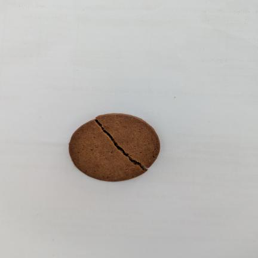
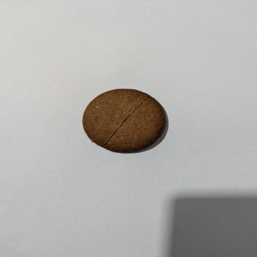
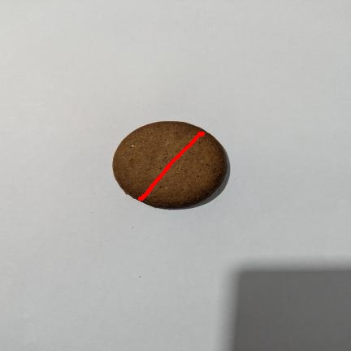
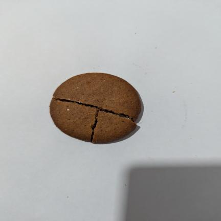
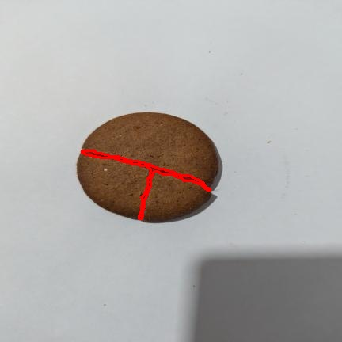
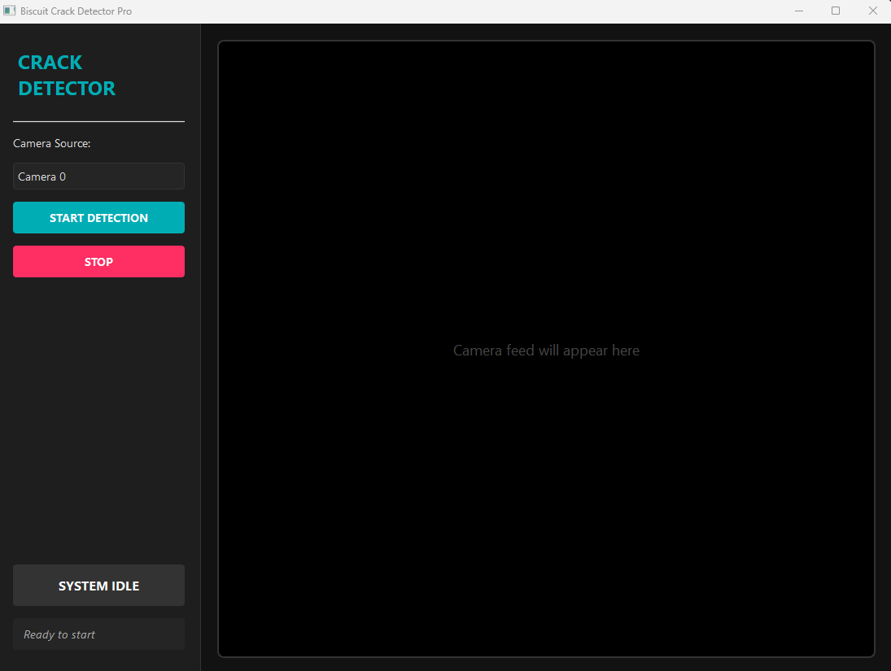

# Biscuit Surface Crack Detector Pro

**Biscuit Crack Detector Pro** is a high-performance industrial inspection tool that utilizes deep learning segmentation to identify and visualize surface defects on biscuits in real-time.

## Setup

1. Create and activate the virtual environment:
   ```
   python -m venv env-test-biscuit
   # On Windows PowerShell:
   .\env-test-biscuit\Scripts\Activate.ps1
   ```
2. Install dependencies:
   ```
   pip install -r requirements.txt
   ```

## Training

1. Organize your dataset as described in `biscuit_crack.yaml`.
2. Run the training script:
   ```
   python train_yolov8_seg.py
   ```

## Inference and UI

### Inference (Prediction)

After training, you can use your best model to predict cracks on new images or video streams.

#### Predict on Images
```
from ultralytics import YOLO

model = YOLO('runs/segment/biscuit_yolov8n_seg/weights/best.pt')
results = model.predict('path/to/image.jpg', save=True)
```
#### Model Performance (Final Epoch - 50)
- **Object Detection (Box)**:
    - **Precision**: 0.985
    - **Recall**: 0.818
    - **mAP50**: 0.881
- **Segmentation (Mask)**:
    - **Precision**: 0.845
    - **Recall**: 0.636
    - **mAP50**: 0.727

## Sample Detection Gallery

Below are some examples of the model detecting surface cracks on biscuits. The cracks are highlighted with a red segmentation mask and a solid red outline.

| Original Image | Detection Result | Description |
| :---: | :---: | :--- |
|  |  | Fine linear crack detected across the center. |
|  |  | Multiple small surface irregularities identified. |
|  |  | Deep structural crack clearly segmented in red. |

- This will save prediction images with crack masks in the `runs/segment/predict/` folder.

#### Predict on Video (Live Camera)
```
model.predict(source=0, show=True)  # 0 = default webcam
```
- Use `source=1`, `2`, etc. for other connected cameras.


## Real-Time UI Usage



The project features a **Biscuit Crack Detector Pro** interface with a modern dark theme and real-time visual feedback.

### Launching the UI
```
python app/main.py
```
- **Pro UI Features**:
    - **Dark Theme**: Professional high-contrast interface.
    - **Sidebar Controls**: Easy camera selection and live detection toggle.
    - **Result Indicator**: Real-time status box (Green: OK, Red: CRACK DETECTED).
    - **Segmentation Overlay**: Direct crack highlighting on the video feed.
- **Model Path**: Uses your trained model at `runs/segment/runs/segment/biscuit_yolov8n_seg/weights/best.pt` by default.

## Troubleshooting
- **DLL Errors (PyTorch)**: If you encounter `WinError 1114`, ensure the import order in `app/main.py` prioritizes `torch` before `PyQt5`.
- **Camera Not Found**: If the camera feed doesn't start, try indices 0, 1, or 2 in the dropdown.
- **Missing Packages**: Activate your environment (`env-test-biscuit`) and run `pip install -r requirements.txt`.

## Contributing
Pull requests are welcome! Please open an issue first to discuss major changes.
Pull requests are welcome! Please open an issue first to discuss major changes.

## Files
- `biscuit_crack.yaml`: Dataset config
- `train_yolov8_seg.py`: Training script
- `env-test-biscuit/`: Virtual environment
- `app/main.py`: PyQt5 Real-time UI Pro for live crack detection

## License
MIT
